Maak een synthesizer die geluid maakt als je een potloodtekening aanraakt (met een Raspberry Pi Pico en CircuitPython).

<!--more-->

Om dingen aanraakgevoelig te maken, gebruiken we dit groene printplaatje, een Pico-microcontroller. Laten we beginnen met het ingebouwde LED-lampje van de Pico te laten knipperen.

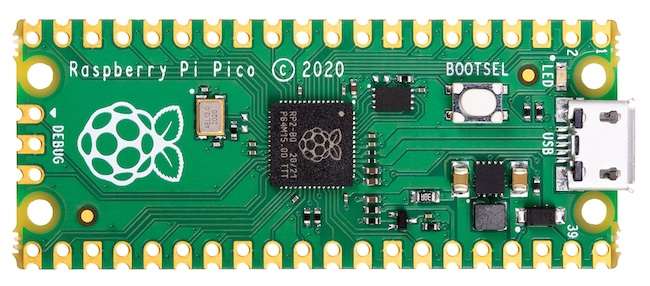

De Raspberry Pi Pico is een **microcontroller**, wat betekent dat het een heel eenvoudige computer is. Je kunt er inputs op aansluiten, zoals lichtsensoren, en outputs zoals motoren en lampen.

Het schema hieronder is de 'pinout' van de Pico. Je kunt er aan zien welke pinnen je kunt gebruiken en wat hun nummers zijn.

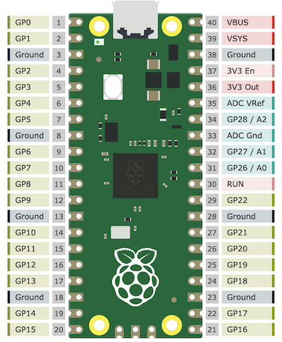


### Software installeren

De Pico die je voor je hebt draait op Circuitpython. Dat is een smaakje Python voor microcontrollers. Je kunt de Pico programmeren met een programma op je computer dat Thonny heet.

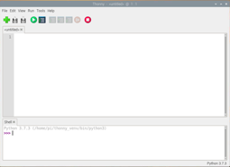

Download Thonny op [thonny.org](http://thonny.org): kies de juiste versie voor jouw computer door in de rechterbovenhoek Windows, Mac of Linux te selecteren. Download het bestand, installeer het en start het programma.

Typ deze regel in het bovenste venster van Thonny:

```Python
print('Hallo wereld!')
```

Klik vervolgens op de groene afspeelknop:


Nu wordt de code uitgevoerd. Het resultaat verschijnt in het onderste deel van het Thonny-venster.


### Je eerste Pico-programma

Nu gaan we met behulp van Thonny code op het Pico-bordje uitvoeren in plaats van op je computer.

Sluit de Pico aan op je computer via een USB-kabel.

Selecteer 'CircuitPython' in de rechteronderhoek van het Thonny-scherm. (Als je die optie niet ziet in de lijst, controleer dan of je Raspberry Pi Pico goed is aangesloten.)

Wanneer je nu code uitvoert, dan gebeurt dat op de Pico. Dat betekent dat we Pico dingen kunnen laten doen, zoals het ingebouwde LED-lampje op de Pico aan en uit kunnen laten gaan. 

Kopieer onderstaande code naar Thonny om Python te laten weten dat we opdrachten willen geven aan de pinnen van de Pico:

```Python
import board
import digitalio
```

Daaronder zet je deze regels om de ingebouwde LED aan te zetten:

```Python
led = digitalio.DigitalInOut(board.LED)
led.direction = digitalio.Direction.OUTPUT
led.value = True
```
Klik op de groene afspeelknop. Het lampje op de Pico zou nu aan moeten gaan. Tenzij het al aan was! In dat geval kun je het uitzetten door de laatste regel te veranderen:

```Python
led.value = False
```

Je kunt ook de LED voortdurend laten knipperen, zonder steeds zelf het programma moet uitvoeren. Voeg deze regels toe aan de vorige code en voer het uit:
```Python
import time
while True:
    led.value = True
    time.sleep(2.0)
    led.value = False
    time.sleep(2.0)
```

Zorg ervoor dat je **ook de witruimte** overneemt (4 spaties), want dat is belangrijk in Python.

De *while-loop* doet steeds opnieuw hetzelfde: zet het LEDje aan, wacht twee seconden, zet het LEDje uit, wacht twee seconden en begin dan weer opnieuw met het LEDje aanzetten.

- Het knipperen gaat nu nog heel langzaam. Probeer het LEDje twee keer zo snel te laten knipperen!

- Kun je het LEDje ook *twintig keer* zo snel laten knipperen?


### Een pin van de Pico aanraakgevoelig maken

Nu gaan we kijken of we de LED aan kunnen laten gaan als we een tekening aanraken. 

Aan de zijkanten van de Pico zitten veel pinnetjes die we kunnen gebruiken om allerlei elektronische onderdelen aan te sluiten, zoals sensoren of motortjes.

De Pico is vastgeklikt in wat een breadboard heet (het witte ding met allemaal kleine gaatjes).

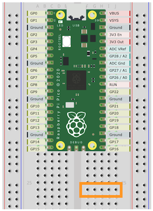

De gaatjes op het breadboard zijn onderling verbonden in rijen van vijf, zoals de oranje rechthoek in het schema aangeeft.

Als we draadjes en onderdelen met elkaar willen verbinden, hoeven we ze alleen maar in gaatjes op dezelfde rij te steken.

De gaatjes langs de rode en blauwe lijnen zijn verticaal met elkaar verbonden. Rood staat voor plus en blauw voor min, net als bij een batterij.

Haal de USB-kabel uit je computer voordat je verder gaat.

In de volgende stappen maak je alle verbindingen precies zoals in dit schema:

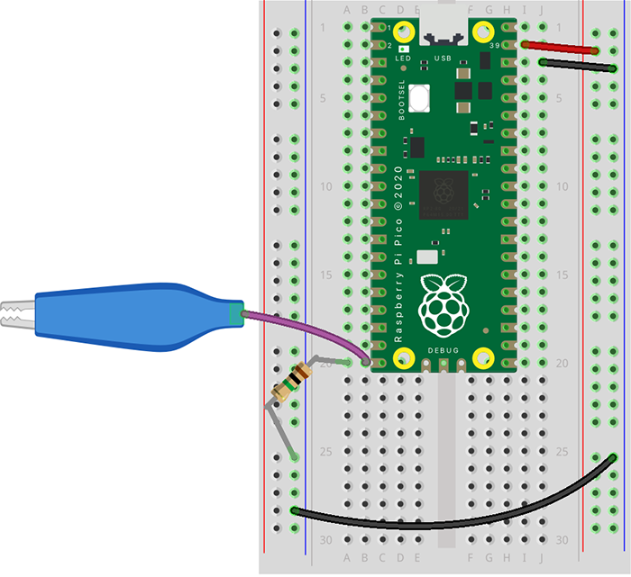


- Pak een kabeltje met een krokodillenklem aan het eind. Steek het pinnetje in het breadboard, vlak naast het laatste pinnetje aan de linkerkant van de Pico.

- Steek één pootje van een weerstand (dat gestreepte dingetje) in dezelfde rij.

- Steek het andere pootje van de weerstand in een van de gaatjes naast de **blauwe** lijn.

- Gebruik een draadje om **beide blauwe kolommen** van het breadboard met elkaar te verbinden. Zorg ervoor dat je het NIET in een gaatje naast de rode lijn steekt!

### 🖍️ Maak je interactieve tekening!

Maak nu een tekening. Het mag een simpele vorm zijn. Zorg dat de tekening tot aan de rand van het papier gaat, zodat je er een krokodillenklem op kunt aansluiten, zoals in dit voorbeeld:

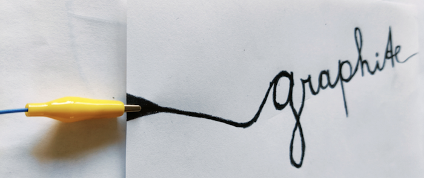

We gebruiken een 9B grafietpotlood, dat is heel zacht en geleidt elektriciteit goed.
Breng een dikke laag grafiet aan. Als je lijnen te dun zijn, maakt de tekening geen goede verbinding met de microcontroller.

Als je klaar bent, klem dan de krokodillenklem die uit je breadboard komt vast op het papier.

### 🔌 Start je programma – Zet het LEDje aan met aanraking

Open Thonny en zet daar deze regels in, direct onder ```import time```:

```Python
import touchio
aanraak_pin = touchio.TouchIn(board.GP15)
```

Nu kun je de Pico vragen om in de gaten te houden of de tekening wordt aangeraakt.
Haal de regels ná ```while True:``` weg en zet daar deze regels voor in de plaats:

```Python
    print(aanraak_pin.raw_value)
    time.sleep(0.05)
```
(Let er weer op dat de vier spaties ervoor staan, want zo weet Python dat deze regels bij de ```while True:``` horen.)

Als je dit programmaatje aanzet door op de groene knop te drukken, dan zie je in Thonny een grafiek die weergeeft hoeveel stroom er 'weglekt' via je tekening. (Als je geen grafiek ziet, klik dan bovenaan in Thonny op het menu 'View' en dan 'Plotter'.)

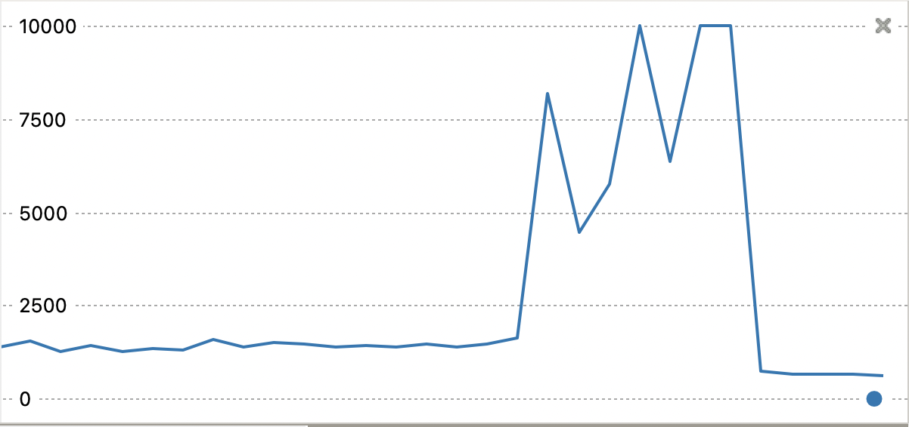

Op basis van die waarden kunnen we de Pico iets laten doen, bijvoorbeeld het LEDje alleen aan laten gaan als de tekening wordt aangeraakt.

Vervang de regel ```print(aanraak_pin.raw_value)``` door een *if-statement*:

```Python
    if aanraak_pin.raw_value > 3000:
        led.value = True
    else:
        led.value = False
```
(Let ook weer op de extra spaties die aangeven wat bij het if-statement hoort en wat niet.)


Start deze code op de Pico door op de start-knop te drukken.

✅ **Test het**: Als je je tekening aanraakt, gaat het ingebouwde LEDje aan!


Als je merkt dat het LEDje ook aanstaat als je je tekening niet aanraakt (vals alarm dus), kies dan een hogere drempelwaarde in plaats van 3000, bijvoorbeeld 7000.


### 🚨 Geen vals alarm

Als we de Pico meer dan één pin-met-tekening in de gaten willen laten houden, dan wordt de kans op vals alarm wat groter. Om dat te voorkomen gaan we bij elke aanraking even opnieuw checken of het wel echt is. Dat heet een 'de-bounce' (het komt bij knoppen vandaan, die kunnen een beetje wiebelen).

In plaats van het if-statement kunnen we dan kijken of de 'knop' ingedrukt is of juist is losgelaten. 

Dit is de complete code die je in Thonny kunt gebruiken: 

```Python
import time
import board
import touchio
import digitalio
from adafruit_debouncer import Debouncer

# Wacht tot alles gestabiliseerd is
time.sleep(1.0)

# Stel GP15 in als aanraakpin
aanraak_pin = touchio.TouchIn(board.GP15)

# debounce 
knop = Debouncer(aanraak_pin)

# Zet het ingebouwde LEDje klaar
led = digitalio.DigitalInOut(board.LED)
led.direction = digitalio.Direction.OUTPUT

while True:
    knop.update()
    
    # als de knop is losgelaten, zet dan de LED uit
    if knop.fell: led.value = False
    
    # als de knop wordt aangeraakt, zet dan de LED aan
    if knop.rose: led.value = True

```

Als de Pico af en toe het LEDje ook aandoet als de tekening *niet* wordt aangeraakt, dan kun je nog steeds een eigen drempelwaarde opgeven. Dat doe je op deze manier, bóven ```while True```: 

```Python
aanraak_pin.threshold = 5100
```

### 🎵 Nu mèt geluid!

Alleen dat ene LEDje aan laten gaan is natuurlijk niet zo spannend. We kunnen je interactieve kunstwerk interessanter maken door een extra uitgang toe te voegen: geluid!

We gaan een kleine versterkte speaker op de Pico aansluiten.

Neem twee kabels met aan de ene kant krokodillenklemmen en aan de andere kant stekkertjes.

Verbind één krokodillenklem met de bovenkant van de plug van de speaker en één met het onderste deel, op deze manier >>

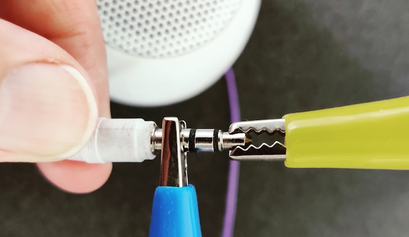

Neem het andere uiteinde van de kabel die aan de tip van de stekker zit en steek die in het breadboard, in de rij naast de onderste rechterpin van de Pico.

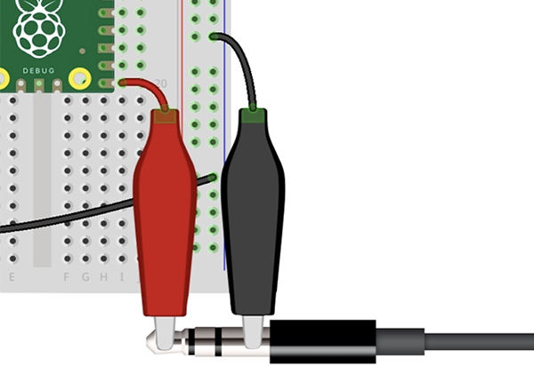

Steek de andere kabel in een gaatje naast de blauwe lijn.

Zet de speaker aan.

Voeg onderstaande code toe aan je script, bovenaan je script maar ná de andere imports:

```Python
import audiopwmio
import synthio
import random

# maak een audio-output op pin GP16
audio = audiopwmio.PWMAudioOut(board.GP16)

# start een synthesizer
synth = synthio.Synthesizer(sample_rate=22050)
audio.play(synth)

# functie om eem willekeurige toon te laten horen
def bliep():
    # toon kiezen
    note = synthio.Note(random.randint(20, 700))
    synth.press(note) # toon 'indrukken'
    time.sleep(0.5) # halve seconde wachten
    synth.release(note) # toon 'loslaten'
```

Vervolgens roepen we die functie aan als de tekening wordt aangeraakt, dus in `if knop.rose`:

```Python
while True:
    knop.update()

    if knop.rose:
        led.value = True
        bliep()

    if knop.fell:
        led.value = False

```

✅ **Test**: Raak je tekening aan → hoor een geluid én zie het LEDje branden!


### ✏️ Meer aanraakgevoelige tekeningen toevoegen

Laten we drie extra aanraakgevoelige tekeningen aan je kunstwerk toevoegen.

Voeg eerst drie sets weerstanden en kabels toe aan het breadboard, zoals in dit schema:

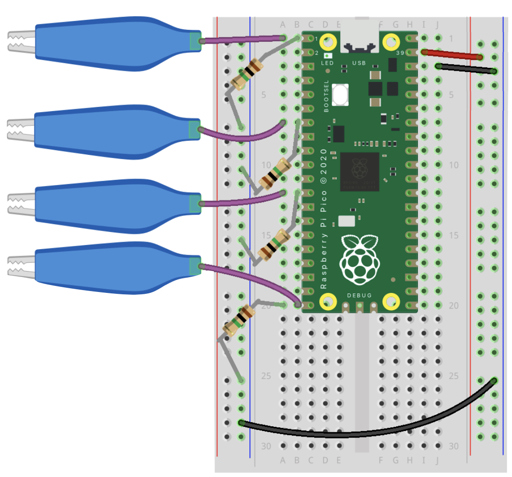

De nieuwe weerstanden verbinden de eerste (GP0), zevende (GP5) en twaalfde pin (GP9) met de blauwe lijn. (Die nummers staan ook op het breadboard.)

Teken nu de extra ‘knoppen’. Je tekening mag van alles zijn, zolang er maar een verbinding is aan de rand zodat je er een krokodillenklem op kunt aansluiten.

Als je de tekeningen hebt gemaakt, klem je de krokodillenklemmen eraan vast.


### Voeg de nieuwe pins toe aan de code

Nu de krokodillenklemmen en weerstanden zijn aangesloten, moeten we de pinnen nog toevoegen aan de code. De regels die je al hebt staan voor de eerste pin kun je kopiëren en plakken en dan aanpassen. 

- Kopieer de regel die begint met ```aanraak_pin``` en plak hem drie keer daaronder.
- Verander vervolgens elke ```aanraak_pin``` in een variabele met een nummer, dus ```aanraak_pin1``` tot en met ```aanraak_pin4```.
- Verander de pin-nummers op het eind, zodat je pins GP0, GP5, GP9 en GP15 hebt.

Vervolgens heb je ook drie extra regels nodig voor de knoppen.
- Kopieer de regel ```knop = Debouncer(aanraak_pin)``` en plak hem drie keer daaronder. 
- Verander elke ```knop``` in een variabele met een nummer, dus ```knop1``` tot en met ```knop4```.
- Laat elk van die regels verwijzen naar een andere aanraak-pin met een nummer.

Nu hoef je alleen nog de knoppen **in de while-loop** toe te voegen.
- Kopieer en plak de regel met ```update``` drie keer.
- Zet de nummers erbij (dus ```knop``` wordt ```knop1``` tot en met ```knop4```).
- Kopieer en plak ook beide if-statements drie keer, zodat je er twee hebt voor elke knop. Zet er wel steeds een witregel tussen om het een beetje leesbaar te houden.
- Voeg aan elke ```knop.rose``` en ```knop.fell``` een nummer toe.

✅ **Test het**: Nu zou de LED aan moeten gaan bij elk van je tekeningen!

Mocht dat niet zo zijn, controleer dan of je de draadjes en weerstanden goed in het breadboard hebt gestoken (naast de eerste, zevende, twaalfde en twintigste pin aan de linkerkant van de Pico).

## 🎵 Nog meer interessante geluiden

Voor de nieuwe pins kunnen we ook meer interessante geluiden toevoegen.

Zet deze drie functies in je script, boven de while-loop:

```Python
def arpeggio():
    for j in range(10, 124, 3):
        synth.press(j)
        time.sleep(0.02)
        synth.release(j)
    for j in range(124, 10, -3):
        synth.press(j)
        time.sleep(0.02)
        synth.release(j)

def bloep():
    for i in range(12, 120, 12):
        synth.press(i)
        time.sleep(0.02)
        synth.release(i)

def drieArpeggios():
    notes = [196, 294, 392, 494, 587, 220, 330, 440, 523, 659, 262, 392, 523, 659, 784]
    for i in range(len(notes)):
        note = synthio.Note(notes[i])
        synth.press(note)
        time.sleep(0.03)
        synth.release(note)
        time.sleep(0.01)
        
        if i % 5 == 4:
            time.sleep(0.2)
```

Roep die functies aan in de `while`-loop, elk bij een ander if-statement:

```Python
    if knop2.rose:
        led.value = True
        arpeggio()
```
```Python
    if knop3.rose:
        led.value = True
        bloep()
```
```Python
    if knop4.rose:
        led.value = True
        drieArpeggios()
```

Je zou nu voor elke tekening verschillende geluiden moeten horen!


## 🎨 Voeg kleur toe met de Neopixel LED

Laten we een andere output proberen: een LED met verschillende kleuren! Deze LED kan op elk aparte tekening reageren met verschillende kleuren!

Haal eerst de USB-kabel even uit je computer.

De Neopixel-LED heeft vier pootjes. Je moet ze misschien een beetje buigen om ze in het breadboard te krijgen.

⚠️ Houd de LED voor je zodat het **pootje met het gele bandje links zit** en **het langste pootje de derde is**. Dit is belangrijk want als je de LED verkeerd in het breadboard steekt dan kan hij stukgaan. 

Je ziet ook dat de LED aan één kant een beetje plat is (je ziet dat het makkelijkst van bovenaf). Die zijde komt aan de zijkant van het breadboard.

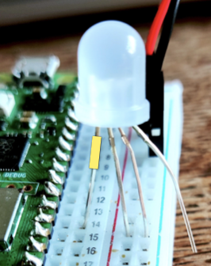

Steek de LED nu in het breadboard zodat:

- het linker pootje (met het gele bandje) in dezelfde rij zit als pin 14 van de Pico (GP21)
- het tweede pootje in de rode kolom zit
- het derde (langste) pootje in de blauwe kolom zit
- het laatste pootje gebruiken we niet, die mag je laten uitsteken over de rand van het breadboard.

Controleer dat de pootjes van de LED elkaar niet raken.

Sluit de USB-kabel weer aan.

Zet bovenaan in je script, ná de andere imports, deze regels:
```Python
import neopixel
from rainbowio import colorwheel

# hiermee laten we de Pico weten waar de LED zit
neopixel_led = neopixel.NeoPixel(board.GP21, 1, brightness=0.7)
```

Je kunt zelf bepalen welke kleur de Neopixel-LED laat zien met de functie `fill`:  

```Python
    neopixel_led.fill((0, 127, 255))
```

De drie getallen in de functie zijn de waarden voor groen, rood en blauw. In het voorbeeld hierboven staat groen uit, rood is 127, dus half aan en blauw staat met 255 vol aan. Het resultaat is roze.

💡 Geef nu de LED bij elke aangeraakte tekening een andere kleur!
(Tip: zet de regel met `fill` boven de regel die het geluid aanzet, dan gaat het licht meteen aan.)

Als je dat voor elkaar hebt, kun je `fill` opnieuw aanroepen bij elke `fell`, om de LED uit te laten gaan als je de tekening loslaat:

```Python
neopixel_led.fill([0, 0, 0])
```

✅ **Test het!** Als je dit script draait en dan je aanraakgevoelige tekening aanraakt, zou je kleuren moeten zien!


## 🌈 Alle kleuren van de regenboog (en veel herrie)

Je kunt de LED ook alle kleuren van de regenboog langs laten gaan zolang je een tekening blijft aanraken. 

We gebruiken daarvoor een `while`-loop die één van de if-statements met `rose` vervangt.

Je kunt een if-statement weghalen, maar je kunt er ook met hashtags commentaar van te maken dat de Pico negeert:

```Python
#     if knop1.rose:
#         led.value = True
#         bliep()
#         neopixel_led.fill((0, 127, 255)) # G, R, B
```

Daarboven zet je deze `while-loop`:

```Python
   # Doe dit zolang de waarde van de 'sensor' hoger is dan 4000:
   while aanraak_pin1.raw_value > 4000:

        # elke 0,09 seconde veranderen we de kleur
        neopixel_led.fill( colorwheel((time.monotonic()*90)%255) )

        # en vergeet niet steeds een ander geluidje te laten horen :-) 
        noot = aanraak_pin1.raw_value / 100
        synth.press(noot)
        time.sleep(0.01)
        synth.release(noot)
```

✅ Als het goed is dan zie je nu bij één rekening alle kleuren van de regenboog voorbij komen en steeds andere geluiden!


## ✅ Klaar!

Vond je het leuk om je tekening aanraakgevoelig te maken? Dan zul je blij zijn te horen dat je nog veel meer dingen interactief kunt maken door ze aanraakgevoelig te maken.

Je kunt je eigen geleidende verf maken en op van alles aanbrengen. Je kunt ook kopertape, metalen draad, aluminiumfolie of zelfs geleidende stof gebruiken.

Water en metalen voorwerpen geleiden ook elektriciteit, dus die werken ook goed.
Planten en bloemen bevatten veel water, dus zelfs die kun je aanraakgevoelig maken. Je zou een synthesizer van bloemen kunnen maken!

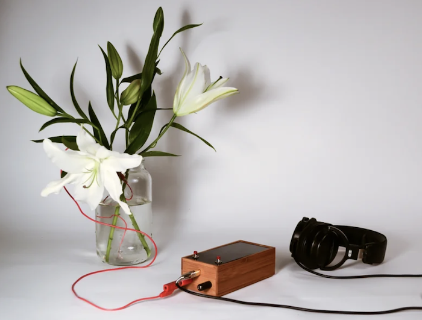

[Singing plant](https://www.instructables.com/Singing-plant-Make-your-plant-sing-with-Arduino-/) door Mads Hobye.


### Gebruikte materialen:

- Raspberry Pi Pico microcontroller
- Breadboard (formaat half)
- 4x Weerstanden 1MΩ
- 3x Jumper-draadjes
- 6x Kabels met krokodillenklem aan één kant, stekkertje aan andere kant
- USB-kabel micro-USB naar USB-A (indien nodig ook USB-C-converter)
- Versterkte mini-speaker (met 3.5mm jack-plug)
- Neopixel-LED
- tekenpapier
- 9B grafietpotlood



